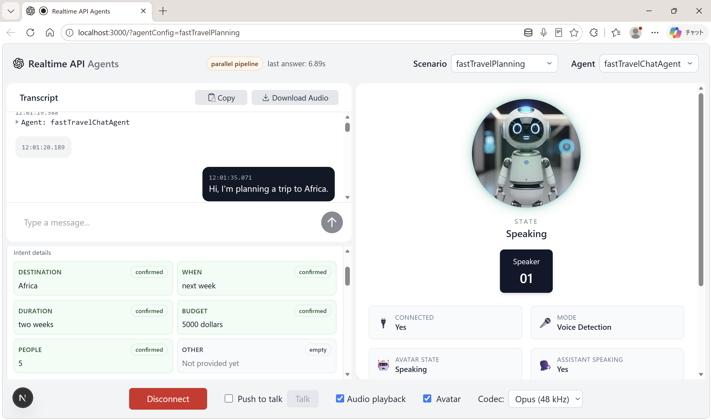

# Ping / Ponder: parallel vs sequential voice-agent pipelines

## Demo

The same travel-planning conversation, run live through both pipelines on a
local machine against the OpenAI Realtime and Responses APIs. The user plans a
trip to Africa by voice; the only thing that differs between the two runs is
whether the reasoning agent blocks the speech agent or runs alongside it.

**The parallel pipeline answered 1.53× faster on average** — 6.07s versus 9.27s
from the end of the user's sentence to a finished answer, a saving of 3.20s per
turn (34.6% reduction). That is an end-to-end figure: it includes the reasoning
delay that the sequential pipeline makes the user sit through.

### The running app



The `fastTravelPlanning` scenario mid-conversation. The header badge shows which
pipeline is active and the time the last answer took. Intent slots fill in as
the user speaks — destination, dates, duration, budget and party size all
confirmed — while the avatar panel reports connection and speaking state.

### Headline comparison


Mean time from the end of the user's sentence to a finished answer. This is the
metric that matters: time-to-first-audio is deliberately fast in both arms,
because the sequential agent opens with a filler phrase before it blocks.

### Per-pipeline detail


The breakdown is where the architecture shows itself:

| | Sequential | Parallel |
|---|---|---|
| answer p50 | 8.79s | **5.88s** |
| answer p95 | 16.10s | **6.89s** |
| reasoning | 3.81s | 8.52s |
| handoff | — | **8ms** |
| plan items | 6 | **10** |

Three things stand out. The **tail collapses**: the worst-case turn goes from
16.10s to 6.89s, because a slow reasoning run no longer blocks the reply.
**Handoff costs 8ms** — that is the entire time the speech agent waits, against
a full reasoning run in the sequential arm. And the parallel pipeline did *more*
thinking, not less (8.52s of reasoning versus 3.81s) while producing a **richer
plan** — 10 items against 6. It is faster and more thorough at the same time,
because the reasoning happens in time the user was spending talking anyway.

One caveat on reading these numbers: this is a live voice demo, so the two arms
saw 5 and 3 turns respectively and the phrasing was not identical between runs.
It demonstrates the effect; it does not control for it. The
[scripted A/B harness](#scripted-ab-reproducible) exists for that, and replays
one fixed script through both pipelines.

---

This project tests one claim:

> Running a slow reasoning agent **in parallel** with a fast speech agent gives
> lower user-faced latency than running it **in sequence**, at comparable
> output quality.

Two agents, two pipelines, one shared state object, and instrumentation to
measure the difference.

- **Ping** — the speech agent. OpenAI Realtime API (`gpt-4o-realtime-preview`),
  runs in the browser over WebRTC, owns the conversation.
- **Ponder** — the reasoning agent. OpenAI Responses API (`gpt-4.1`), runs
  server-side, calls lookup tools, and writes findings into shared state.

## The two pipelines

Pick between them with the **Scenario** dropdown.

### `travelPlanning` — sequential (the baseline)

```
user speaks ──► Ping ──► "let me check that for you"
                 │
                 └──► Ponder (model + tool loop) ─────────┐  user waits
                                                          │
                      Ping speaks Ponder's words ◄────────┘
```

Ping cannot say anything substantive until Ponder returns the words to say.
Every millisecond of reasoning lands on the user.

### `fastTravelPlanning` — parallel

```
user speaks ──► Ping ──► updateSlot ─┬─► records the slot
                 │                   ├─► starts Ponder in the background
                 │                   └─► returns findings from LAST turn
                 │
                 └──► Ping answers immediately  ◄── user waits only for this
                                    
                      Ponder (background) ──► writes into shared state
                                                       │
                      surfaces on the next turn ───────┘
```

Ping never waits. Ponder's latency is absorbed into the time the user spends
thinking and talking.

`updateSlot` deliberately does all three jobs in one call. Each extra tool call
costs a model turn plus a round trip *before Ping can speak*, so splitting this
into record / kickoff / check would have put ~3 round trips on the critical path
and eaten much of the win.

**The only difference between the two scenarios is the orchestration.** Same
voice, same greeting, same domain, same lookup tools, same state schema — so the
comparison isolates the architecture.

## Shared state

One server-side store, `conversation_logs/session_<id>_state.json`, is the
single source of truth. Both agents read and write it through `/api/state`.

```
intent_clarification:  destination, when, duration, budget, people, other
                       each { value, status: empty|proposed|confirmed, source, updatedAt }

plan_sharing:          cities, attractions, food, itinerary, accommodation, events, other
                       each item { value, status, source: ping|ponder, addedAt }

meta:                  conversation_phase, intent_status, version, updatedAt
```

`source` and `addedAt` are what make the parallelism visible: the UI badges
anything Ponder wrote and highlights items added in the last 10 seconds.

Writes are serialized per session by a promise-chain lock, because in the
parallel pipeline a background job and a foreground turn genuinely do write
concurrently, and `addPlanItem` is a read-modify-write.

## Measuring it

### The headline metric: time to answer

`turn_completion` — from the user finishing their sentence
(`input_audio_buffer.speech_stopped`) to the assistant's turn being complete
(`response.done`). Measured in the browser, since it spans WebRTC events.

**Why not time-to-first-audio?** Because it would hide the entire effect. The
sequential agent is *designed* to say "let me check that for you" before it
blocks on Ponder. So first-audio is fast in both pipelines — around a second
either way — while the sequential user then sits through four more seconds of
silence before getting an actual answer. Time-to-first-audio measures how
quickly the agent starts making noise; time-to-answer measures how quickly the
user can act. The second one is the claim.

| Metric | Meaning |
|---|---|
| `turn_completion` | **headline.** End of user speech → answer finished |
| `turn_latency` | end of user speech → first audio. Fast in both arms; tracked to prove the parallel pipeline doesn't regress it |
| `ponder_run` | wall clock of a reasoning run — the cost the parallel pipeline hides |
| `ponder_kickoff` | how long Ping was blocked handing work off (parallel only) |
| `plan_items_added` | plan items a run produced |

If you report only one number, report `turn_completion`. If you report two,
report both — the pair is the actual story: *comparable time to first sound,
far shorter time to a usable answer.*

**One subtlety worth knowing about**, because getting it wrong silently inverts
the result: in the Realtime API a blocking tool call splits one conversational
turn across **two** responses — response 1 is the filler phrase plus the
`function_call`, then the tool runs, then response 2 carries the answer. So
`response.done` fires twice, and naively stopping the clock on the first one
times only the filler and reports the sequential pipeline as fast.

`useTurnLatency` therefore inspects the finished response's `output` for a
`function_call` item: if one is present the turn is not over and the clock keeps
running. The `responses` field on each sample records how many responses the
turn spanned — expect 2 in the sequential arm and 1 in the parallel arm.

All events append to `conversation_logs/session_<id>_metrics.jsonl`.

### Live demo

1. `npm i && npm run dev`, open http://localhost:3000
2. Choose `travelPlanning`, plan a trip by voice. Watch the latency panel.
3. Switch to `fastTravelPlanning`. State resets automatically so the arms don't
   contaminate each other. Plan the same trip.
4. The panel now shows both arms and the speedup.

Watch the plan panel during the parallel run: items appear **while you are still
being asked questions**. In the sequential run they only appear after a pause.

### Scripted A/B (reproducible)

A live voice demo is a demo, not a measurement — you cannot speak the same
sentences twice with the same timing. Click **Run scripted A/B**, or:

```bash
curl -X POST http://localhost:3000/api/benchmark \
  -H 'Content-Type: application/json' \
  -d '{"pingResponseMs": 700, "sessionId": "my-run"}' | jq .comparison
```

This replays one fixed 6-turn script through both pipelines and reports per-turn
numbers. Each arm runs against its own isolated state session, so they cannot
contaminate each other, but the metrics are filed under the `sessionId` you pass
so they also show up in the live panel. Omit it and the numbers come back only
in the response body.

**What is measured vs. modelled — read this before quoting a number.**

- **Measured, live:** `blockingMs` per turn — real model calls, real tool loops.
  Sequential blocks on the whole Ponder run; parallel blocks only on the kickoff.
  This *is* the architectural difference.
- **Modelled:** `pingResponseMs`, the realtime voice model's own speaking time.
  It is identical in both arms and cannot be driven from the server, so it is
  added to both as a labelled constant. Take your real value from the live
  `turn_latency` p50 and pass it in — the UI button does this automatically.
  Because it is added equally to both arms, it dilutes the measured ratio rather
  than inflating it: the reported speedup is conservative.

The benchmark also reports final plan item count per arm, so you can check that
the parallel pipeline's lower latency did not come at the cost of a thinner plan.

## Layout

```
src/app/agentConfigs/TravelPlanningAgent/
  stateTypes.ts        types + defaults + deriveState  (client-safe, no fs)
  stateStore.ts        SERVER-ONLY source of truth, per-session lock
  ponder.ts            SERVER-ONLY reasoning engine, tool loop, plan population
  jobs.ts              SERVER-ONLY background job registry (the async half)
  clientSession.ts     resolves sessionId / scenario / history in the browser
  stateTools.ts        Ping's state tools, incl. checkPlanUpdates
  supervisorAgent.ts   sequential: blocking client stub
  index.ts             sequential agent + prompt
  fast/
    fastSupervisorAgent.ts  parallel: non-blocking kickoff + explicit wait escape hatch
    index.ts                parallel agent + prompt
  LookupData.ts        the lookup database

src/app/api/
  state/         GET state + derived + job status; POST mutations
  supervisor/    POST sync|async Ponder; GET job status
  metrics/       POST/GET/DELETE latency metrics
  benchmark/     POST scripted A/B
  responses/     OpenAI Responses proxy (used by guardrails + other scenarios)
  session/       Realtime ephemeral key

src/app/
  hooks/useTurnLatency.ts     browser-side headline metric
  components/ConversationStage.tsx  intent slots + plan + "Ponder thinking"
  components/LatencyPanel.tsx       KPI row, comparison, A/B button
```

Anything importing `fs` (`stateStore`, `ponder`, `jobs`, `lib/metrics`) is
server-only and must never be pulled into a client component or a browser-side
agent tool. `stateTypes.ts` exists to give both sides shared types without that.

## Configuration

| Variable | Default | Purpose |
|---|---|---|
| `OPENAI_API_KEY` | — | required |
| `PONDER_MODEL` | `gpt-4.1` | Ponder's model |
| `PONDER_SIMULATED_TOOL_LATENCY_MS` | `500` | see below |

## Honest limitations

- **`webSearch` is a stub.** It returns labelled placeholders
  (`simulated: true`) after a configurable delay. The lookup DBs answer
  instantly, which would make Ponder unrealistically cheap and *understate* the
  latency the parallel pipeline hides; the delay models a real search API. The
  genuine reasoning latency (a multi-turn `gpt-4.1` tool loop, typically
  seconds) is real and dominates either way. Swap in a real search API before
  publishing numbers.
- **Job registry is in-memory and single-process.** Fine for one dev server;
  a multi-instance deployment needs a real queue.
- **At most one in-flight Ponder job per session.** Concurrent runs would fight
  over state, so a kickoff arriving while one is running is coalesced into it.
- **Results arrive a turn late.** Ponder's findings surface when Ping next calls
  `checkPlanUpdates`. There is no proactive interruption when a job finishes
  while the user is idle — that would need a push channel and a barge-in policy.
- **The parallel agent can still choose to block** via `askResearcherAndWait`.
  This is deliberate: some direct factual questions are better answered late
  than bluffed. It is described unattractively in the prompt, but if your
  measured parallel latency looks high, check the transcript breadcrumbs for
  `[ponder:sync-fallback]`.
